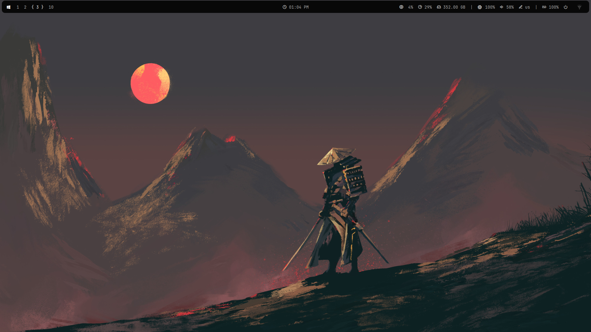
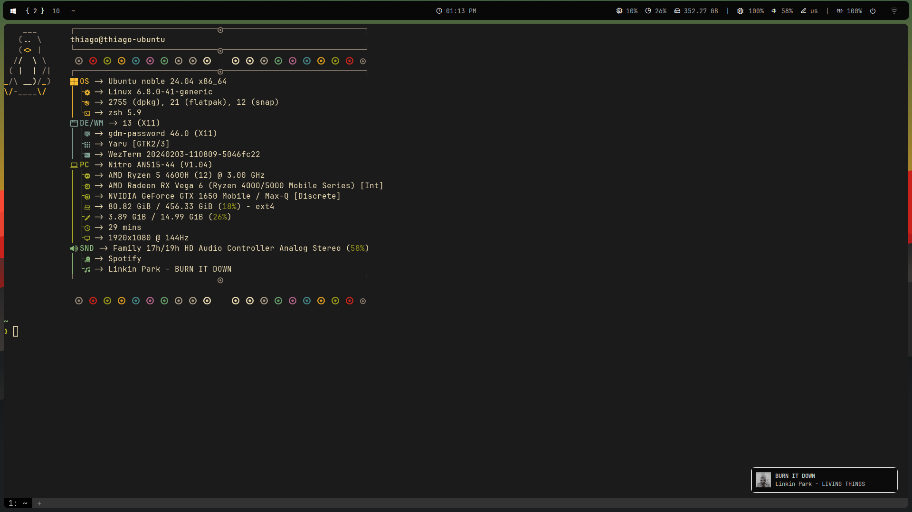
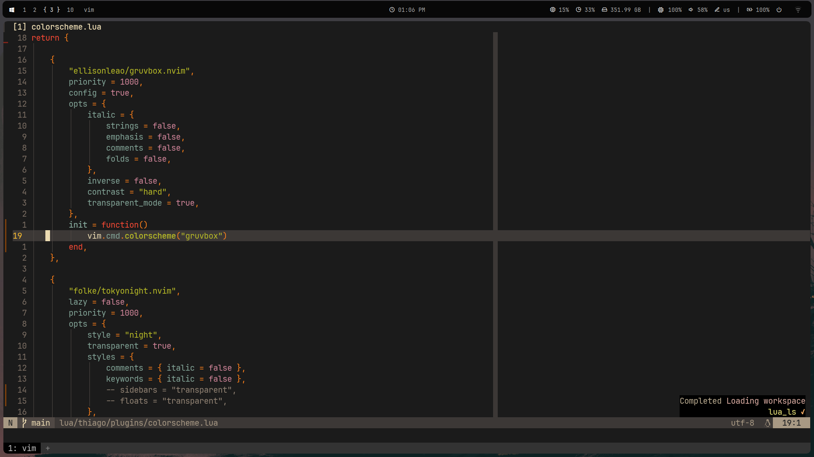

# Ubuntu config files 

- i3-wm
- Wezterm
- Zsh with Oh-My-zsh / Starship theme
- Notifications with Dunst, app launcher with Rofi, top bar with Polybar
- [Neovim](https://github.com/ThiiagoAC7/nvim)
- Gnome with extensions:
    - Top bar organizer
    - Vitals
    - Space Bar
    - Forge

## Screenshots

- desktop
 

- wezterm 
 

- nvim 
 

